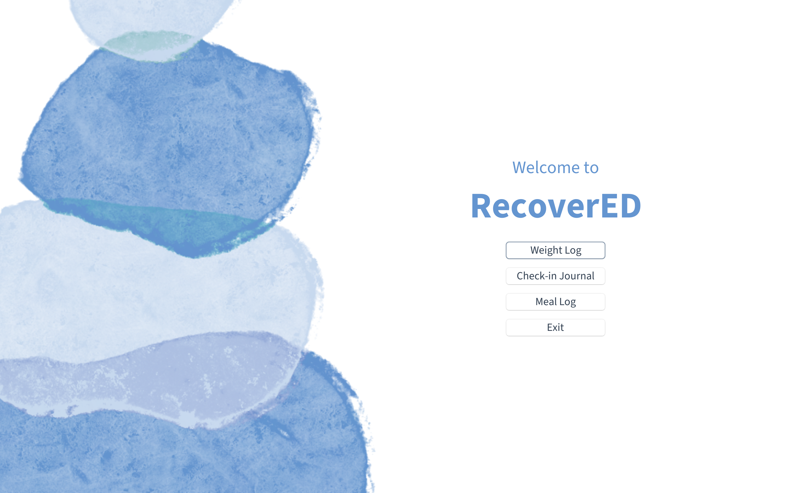
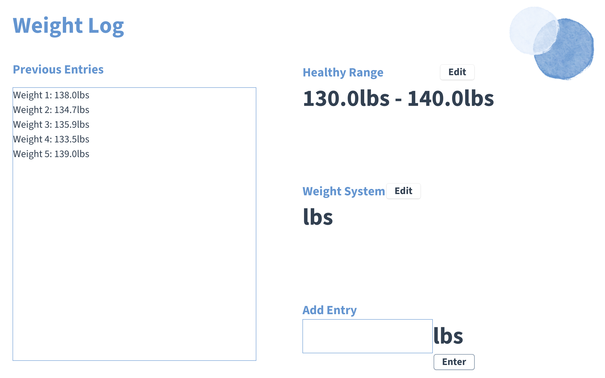

# RecoverED

## Eating Disorder Management Application
***RecoverED*** is an application with tools to aid in the process of managing an eating disorder. 
Catered towards those in the recovery phase from eating disorders and those seeking to foster
a healthier relationship with food and overall well-being, the application features meal-tracking software
enabling users to input information about their daily meals and thoughts. Additionally, it includes a check-in 
journal for monitoring recovery progress and setting goals, along with a weight log. 

My interest in this project stems from the observation that while numerous health and food-related applications 
exist, very few specifically address the cultivation of a positive relationship with food and weight. 
There is a scarcity of options for individuals seeking software tailored to this purpose. 
The eating disorder recovery process involves various tasks that necessitate tracking and documentation, 
and the application aims to optimize these processes electronically. 
In doing so, it seeks to address a widespread issue that the tech industry has largely overlooked.

## User Stories

Meal tracker:
- As a user, I want to be able to add a meal to a meal log and specify/enter...
  - Food(s)
  - Location
  - Meal/snack type
  - Stress level
  - Worries
  - Response to worries
  - Other thoughts
- As a user, I want to be able to view a list of meal entries

Check-in log:
- As a user, I want to be able to add an entry to a check-in log and specify/fill in...
  - Estimated and actual weights in pounds
  - Thoughts
  - Eating disorder management checklist
  - Future goals
- As a user, I want to be able to view a list of journal entries
- As a user, I want to be able to enter a number of entries X, and view journal statistics for the last X entries, including
  - The average difference between expected and actual weights in pounds
  - The overall and average number of goals completed

Weight log:
- As a user, I want to be able to add a new weight to a weight log
- As a user, I want to be able to view a list of weight entries
- As a user, I want to be able to specify a healthy weight range and be warned if I enter a weight outside of that range
- As a user, I want to be able to specify a weight measurement system (kg, lbs, or stone), and have all the weights 
displayed in the proper units

Save data:
- As a user, I want to have the option to save my meal log, check-in log and weight log data when closing
the program
- As a user, I want to have the option to load my meal log, check-in log and weight log data when opening
  the program

